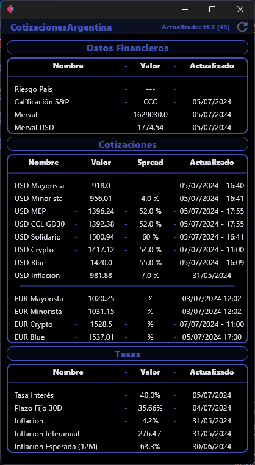

# Cotizaciones Argentina

Desarrollada con FLET

> [!ALERTA]
> Esta app es solo una prueba conceptual que hice para practicar, no tomar los datos mostrados como verdídicos ya que podria haber errores.

## Datos Mostrados

1. Datos Financieros
    * Riesgo Pais
    * Calificación S&P
    * Merval
    * Merval USD
2. Cotizaciones
    * USD Mayorista
    * USD Minorista
    * USD MEP
    * USD CCL
    * USD Solidario
    * USD Crypto
    * USD Blue
    * USD Inflación
    * EUR Mayorista
    * EUR Minorista
    * EUR Crypto
    * EUR Blue
3. Tasas
    * Tasa Interés
    * Plazo Fijo 30D
    * Inflación Mensual
    * Inflación Interanual
    * Inflación Esperada

> [!IMPORTANTE]
> Se necesita tener chrome en la carpeta principal (chromium mejor), o cambiar la ruta de instalacion en ambito_dg.py.